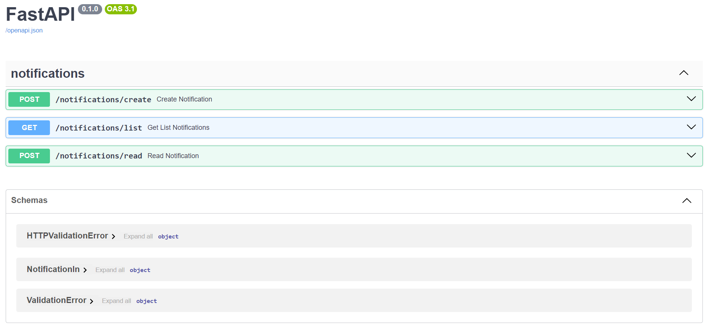

# Docs notifications RESTful API

## Task.

    Написать микросервис уведомления пользователей. 
    
    Микросервис должен представлять из себя RestAPI сервер, который позволяет создавать запись уведомления в документе пользователя в MongoDB, отправлять email, а так же предоставлять листинг уведомлений из документа пользователя.
    
    Уведомления пользователей должны храниться в поле в документе пользователя и их максимальное кол-во должно быть ограничено (лимит можно установить произвольный)
    
    При тестировании отправки Email отпраляйте key от создаваемого уведомления.
    
    #### Пример уведомления в документе пользователя
    
    ```json
    {
        "id": "some_notification_id",
        "timestamp": 1698138241,
        "is_new": false,
        "user_id": "638f394d4b7243fc0399ea67",
        "key": "new_message",
        "target_id": "0399ea67638f394d4b7243fc",
        "data": {
            "some_field": "some_value"
        },
    },
    ```
    
    Для теста в случае отсутствия пользователя следует создать новый профиль с email, который задан через параметры.
    
    ## Переменные окружения, через которые конфигурируется сервис
    
    - PORT - порт на котором будет работать приложение
      - EMAIL - тестовый email
      - DB_URI - строка для подключения к mongoDB
      - SMTP_HOST - хост smtp сервера
      - SMTP_PORT - порт smtp сервера
      - SMTP_LOGIN - логин пользователя
      - SMTP_PASSWORD - пароль пользователя
      - SMTP_EMAIL - email с которого будет отправлено сообщение
      - SMTP_NAME - Имя отображаемое у получателя письма
    
    ## API Handlers: 
    
    ### [POST] /create создает новое уведомление.
    
    #### Тело запроса:
    
    - user_id - строка на 24 символа (является ObjectID документа пользователя которому отправляется уведомление)
      - target_id - строка на 24 символа (является ObjectID документа сущности, к которой относится уведомление) (Может отсутствовать)
      - key - ключ уведомления enum
          - registration (Только отправит пользователю Email)
          - new_message (только создаст запись в документе пользователя)
          - new_post (только создаст запись в документе пользователя)
          - new_login (Создаст запись в документе пользователя и отправит email)
      - data - произвольный объект из пар ключ/значение (Может отсутствовать)
    
    #### Пример тела запроса:
    
    ```json
    {
        "user_id": "638f394d4b7243fc0399ea67",
        "key": "registration",
    }
    ```
    
    #### Пример ответа
    
    HTTP 201 Created
    
    ```json
    {
        "success": true,
    }
    ```
    
    ### [GET] /list производит листинг уведомлений пользователя.
    
    #### query params
    - user_id [string] - идентификатор пользователя
      - skip [int] - кол-во уведомлений, которые следует пропустить
      - limit [int] - кол-во уведомлений которые следует вернуть
    
    #### Пример ответа
    
    HTTP 200 Ok
    
    ```json
    {
        "success": true,
        "data": {
            "elements": 23, // всего уведомлений
            "new": 12, // Кол-во непрочитанных уведомлений
            "request": {
                "user_id": "638f394d4b7243fc0399ea67",
                "skip": 0,
                "limit": 10,
            }
            "list": [
                {
                    "id": "some_notification_id",
                    "timestamp": 1698138241,
                    "is_new": false,
                    "user_id": "638f394d4b7243fc0399ea67",
                    "key": "new_message",
                    "target_id": "0399ea67638f394d4b7243fc",
                    "data": {
                        "some_field": "some_value"
                    },
                },
                ...
            ]
        }
    }
    ```
    
    #### [POST] /read создает отметку о прочтении уведомления.
    
    #### query params
    - user_id [string] - идентификатор пользователя
      - notification_id [string] - Идентификатор уведомления
    
    #### Пример ответа
    
    HTTP 200 Ok
    
    ```json
    {
        "success": true,
    }
    ```
    
    ## На ваше усмотрение
    
    Вам позволено решать указанные выше задачи тем способом, который вы сочтете наиболее подходящим. Кратко опишите свой подход в решении задач в Readme файле в репозитории.
    
    ## Результат выполнения задания
    
    Данное задание будет считаться выполненным при условии размещения кода и Dockerfile'a в репозитории на github.com.

## Version

- python3.12
- docker engine 24.0.7

## Deploy docker container Mongo and set replica

- https://www.mongodb.com/docs/manual/tutorial/deploy-replica-set/
- deploy test container
  ```bash
  cd mg/ && sudo docker compose up -d
  ```
- Internal container
  ```bash
  sudo docker exec -it mg-mongo-1 bash
  ```
- Inside docker container mongo
  ```bash
  mongosh
  ```
- *Set replica*
  ```bash
  rs.initiate()
  ```
- Show status and config
  ```bash
  rs.conf()
  rs.status()
  ```
- reload container(before exit)
  ```bash
  sudo docker compose up -d
  ``` 
For testing, you need add first user in Mongo(example, with mongo-express)
- web auth 
  + username: `admin` 
  + password: `pass`
- create database with name `artem`
- create 2 collections: `users`, `notifications`
- create first user in collection `users`: 
  ```text
  {
          "email": "example.@mail.ru"
  }
  ```

## app

- write all required values in .env
- ```bash
  python3 -m venv venv
  && source venv/bin/activate
  && uvicorn app.main:app
  ```
- go http://127.0.0.1:8000/docs
  

## microservice
- Change in `.env` where MONGO_HOST **127.0.0.1** -> **mongo**
- if everything works, then we launch the microservice and also configure mongo
  ```bash
  cd microservice/ && sudo docker compose up -d
  ```
- create replica(transaction support)
- reload docker containers

## Security

- if necessary add certificates and nginx
- changes hosts from 0.0.0.0 to 127.0.0.1
- add params for mongodb --keyfile, --auth, ...


## Sources

- Deploy a Replica Set https://www.mongodb.com/docs/manual/tutorial/deploy-replica-set/
- Update Replica Set to Keyfile Authentication https://www.mongodb.com/docs/manual/tutorial/enforce-keyfile-access-control-in-existing-replica-set/
- Replica Set in docker
  compose https://www.mongodb.com/community/forums/t/convert-standalone-docker-compose-version-to-replica-set-primary/201446
- Mongo DB connection https://mongodb.github.io/node-mongodb-native/3.3/tutorials/connect/
- ACID Mongo https://www.mongodb.com/basics/acid-transactions
- send email https://realpython.com/python-send-email/
- async send email https://github.com/cole/aiosmtplib
- mongo url https://www.mongodb.com/docs/v3.0/reference/connection-string/
- diff replica https://www.mongodb.com/community/forums/t/having-a-problem-when-trying-to-connect-to-replica-set-with-compass-and-with-python-code/172465
